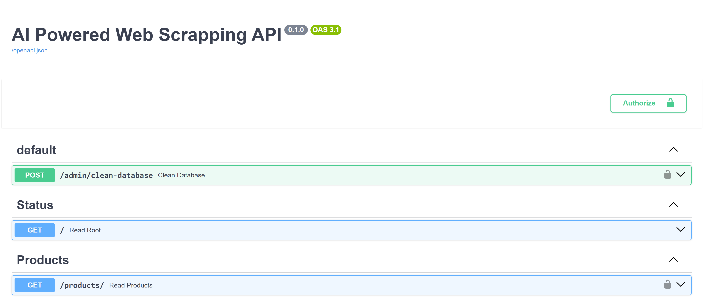

<h1 align="center">🕷️ AI Powered Web Scrapping</h1>

<p align="center">
  <strong>Enterprise-Grade Automated Data Extraction & AI-Enriched Processing Pipeline</strong>
</p>

## 📌 About The Project

**AI Powered Web Scrapping** is a highly resilient, fully containerized hybrid data pipeline designed to extract raw data from target websites, process it into clean, structured datasets, enrich it using Large Language Models (LLMs), and serve it via an interactive Dashboard and a REST API.

Whether you need to monitor competitor pricing, aggregate catalog data, or feed machine learning models, this system guarantees **no data loss** and **idempotent** data ingestion, now supercharged with Google Gemini AI.

## 🖼️ Project Preview


### 🚀 Key Value Propositions
* **Safety Net Architecture:** Source website changed its layout? No problem. We store the raw HTML/JSON in a NoSQL database *before* processing it. You never lose historical data.
* **AI-Powered Enrichment:** Automatically generates professional product summaries, sentiment analysis, and entity extraction using Google Gemini AI before persisting to the Gold layer.
* **High Data Quality:** Cleaned, deduplicated, and standardized data delivered via rigorous Data Contracts (Pydantic). 
* **Full Automation:** Configure the bot once via the interactive dashboard and let it run on a schedule.
* **Cloud-Ready & Turnkey Local:** Deployed on Render for live access, with a single `docker-compose up` command for local development.

---

## 🌐 Live Demo (Cloud Deployment)

The project is currently deployed and live. You can interact with the system here:

* **📊 Live Dashboard (Streamlit):** [https://web-collector-dashboard.onrender.com](https://web-collector-dashboard.onrender.com)
* **⚙️ REST API (Swagger UI):** [https://web-collector-expert.onrender.com/docs](https://web-collector-expert.onrender.com/docs)

**Cloud Infrastructure Setup:**
* **Frontend & Backend Hosting:** Render (Web Services)
* **Bronze Layer Database:** MongoDB Atlas (Cloud NoSQL)
* **Gold Layer Database:** Neon (Serverless PostgreSQL)

---

## 🧠 Medallion Architecture

The project implements a modern data engineering pattern (Bronze/Gold Layers) to ensure reliability:

1. **🌐 Scraper Layer:** Automated crawling with smart pagination and user-agent rotation.
2. **🥉 Bronze Layer (MongoDB):** Unstructured, raw HTML storage. The ultimate fallback.
3. **⚙️ Processing & AI Worker (Pandas & Gemini):** Cleans prices, normalizes text, removes HTML tags, and calls the Google Gemini LLM to generate `ai_summary`, `ai_sentiment`, and `ai_entities`.
4. **🥇 Gold Layer (PostgreSQL):** Relational, strict-schema storage for high-quality, enriched final data.
5. **📊 Delivery (FastAPI & Streamlit):** Data served through secured API endpoints and an interactive web panel.

---

## 🛠️ Virtual Environment & Tools Explained

To maintain a lean and efficient environment, specific tools were carefully selected for this architecture. Here is what each tool installed in the virtual environment is used for:

* **`fastapi` & `uvicorn`**: Powers the high-performance REST API and its asynchronous ASGI server.
* **`streamlit`**: Rapidly builds the interactive, data-focused web dashboard for user control and data visualization.
* **`beautifulsoup4`, `requests`, `fake-useragent`**: The core scraping stack for fetching, parsing HTML content, and avoiding basic bot detection by rotating headers.
* **`pandas`**: The workhorse of the Refining Layer, used to clean, transform, and deduplicate data efficiently.
* **`google-generativeai`**: Integrates with the Google Gemini API to analyze raw text and extract professional summaries, sentiments, and key entities.
* **`pydantic`**: Enforces strict data validation and schema definitions, ensuring the data returned by the scraper and the AI always matches the expected format.
* **`motor`, `pymongo`, `dnspython`**: Drivers enabling asynchronous and secure connections, as well as DNS resolution, to the MongoDB Atlas cluster (Bronze Layer).
* **`sqlalchemy`, `psycopg2-binary`**: The ORM (Object Relational Mapper) and PostgreSQL adapter handling structured queries and transactions with the Gold Layer database.
* **`apscheduler`**: Manages the internal clock for automated, scheduled web scraping routines in the background.
* **`python-dotenv`**: Keeps sensitive credentials secure by loading them from a `.env` file into the application's environment variables.

---

## 🛠️ How to Run the Project

### Prerequisites
You only need Docker and Docker Compose installed on your machine.

### Installation Steps

1. **Clone the repository:**
   ```bash
   git clone [https://github.com/your-username/web-collector-expert.git](https://github.com/your-username/web-collector-expert.git)
   cd web-collector-expert

2. **Create the Environment File:**
   # API Security
  API_KEY=your-super-secret-key-123

  # AI Enrichment
  GEMINI_API_KEY=your_google_ai_studio_key_here

  # Databases
  MONGO_URL="mongodb+srv://<user>:<password>@<cluster>.mongodb.net/raw_data_db?appName=web-collector-expert"
  DATABASE_URL="postgresql://<user>:<password>@<neon-hostname>/<dbname>"

3. **Spin up the Infrastructure:**
   ```bash
   docker-compose up -d --build
   ```
   *This command will download the necessary images, build the APIs, and link the databases automatically.*

---

## 🎮 Usage

Once the containers are running, you can access the following services:

### 1. The Control Dashboard (Streamlit)
* **URL:** http://localhost:8501
* **What you can do:** 
  - Trigger a manual extraction pipeline instantly.
  - Configure the Background Scheduler to run the scraper every *X* minutes.
  - Visualize the clean data (Gold Layer) with the AI-enriched in a tabular format.

### 2. REST API & Swagger UI (FastAPI)

* **URL:** http://localhost:8000/docs
* **What you can do:** 
  - Explore the API endpoints directly from your browser.
  - Test the `/products/` endpoint to fetch paginated data.
  - Integrate the data with other frontends or mobile apps.

*(Note: When accessing the API endpoints directly, remember to pass your API Key in the `X-API-Key` header).*

---

##🐛 Fixed Bugs & Issues

 Throughout the development of the data pipeline, the following key issues were mapped and resolved: 

 *  MongoDB Authentication & Database Routing: Fixed a `bad auth` `OperationFailure` by sanitizing password credentials and updated the MongoDB connection string to route directly to `raw_data_db`, allowing the system to properly locate and read from the `raw_html_payloads` collection.

 * PostgreSQL Schema Sync (UndefinedColumn): Resolved an issue where SQLAlchemy's `Base.metadata.create_all()` did not automatically detect new columns added to the Python ORM model (such as `ai_summary`, `ai_sentiment`, `ai_entities`). Applied explicit `ALTER TABLE` SQL commands in the Neon console to synchronize the existing database structure with the updated Pydantic and SQLAlchemy schemas without data loss.

## 📜 License

Distributed under the MIT License. See `LICENSE` for more information.

---
*Built with 💻 and ☕ for robust data engineering.*