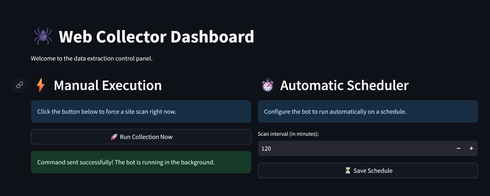
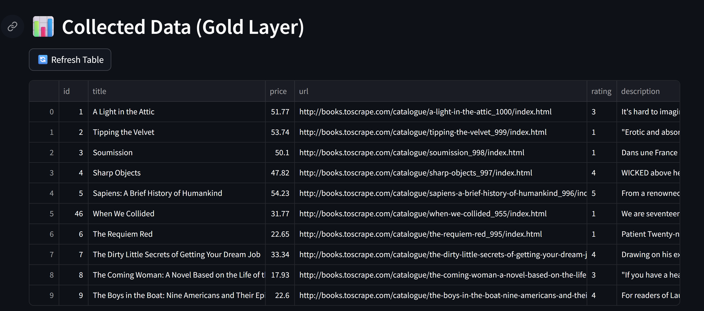

<h1 align="center">🕷️ Web Collector Expert</h1>

<p align="center">
  <strong>Enterprise-Grade Automated Data Extraction & Processing Pipeline</strong>
</p>

## 📌 About The Project

**Web Collector Expert** is a highly resilient, fully containerized hybrid data pipeline designed to extract raw data from target websites, process it into clean, structured datasets, and serve it via an interactive Dashboard and a REST API.

Whether you need to monitor competitor pricing, aggregate catalog data, or feed machine learning models, this system guarantees **no data loss** and **idempotent** data ingestion.

## 🖼️ Project Preview



### 🚀 Key Value Propositions
* **Safety Net Architecture:** Source website changed its layout? No problem. We store the raw HTML/JSON in a NoSQL database *before* processing it. You never lose historical data.
* **High Data Quality:** Cleaned, deduplicated, and standardized data delivered via rigorous Data Contracts (Pydantic). 
* **Full Automation:** Configure the bot once via the interactive dashboard and let it run on a schedule.
* **Cloud-Ready & Turnkey Local:** Deployed on Render for live access, with a single `docker-compose up` command for local development.

---

## 🌐 Live Demo (Cloud Deployment)

The project is currently deployed and live. You can interact with the system here:

* **📊 Live Dashboard (Streamlit):** [https://web-collector-dashboard.onrender.com](https://web-collector-dashboard.onrender.com)
* **⚙️ REST API (Swagger UI):** [https://web-collector-expert.onrender.com/docs](https://web-collector-expert.onrender.com/docs)

**Cloud Infrastructure Setup:**
* **Frontend & Backend Hosting:** Render (Web Services)
* **Bronze Layer Database:** MongoDB Atlas (Cloud NoSQL)
* **Gold Layer Database:** Neon (Serverless PostgreSQL)

---

## 🧠 Medallion Architecture

The project implements a modern data engineering pattern (Bronze/Gold Layers) to ensure reliability:

1. **🌐 Scraper Layer:** Automated crawling with smart pagination and user-agent rotation.
2. **🥉 Bronze Layer (MongoDB):** Unstructured, raw data storage. The ultimate fallback.
3. **⚙️ Processing Worker (Pandas):** Cleans prices, normalizes text, removes HTML tags, and ensures idempotency.
4. **🥇 Gold Layer (PostgreSQL):** Relational, strict-schema storage for high-quality final data.
5. **📊 Delivery (FastAPI & Streamlit):** Data served through secured API endpoints and an interactive web panel.

---

## 🛠️ Virtual Environment & Tools Explained

To maintain a lean and efficient environment, specific tools were carefully selected for this architecture:

* **`fastapi` & `uvicorn`**: Powers the high-performance REST API and its asynchronous server.
* **`streamlit`**: Rapidly builds the interactive, data-focused web dashboard for users.
* **`beautifulsoup4`, `requests`, `fake-useragent`**: The core scraping stack for fetching, parsing HTML, and avoiding basic bot detection.
* **`pandas`**: The workhorse of the Refining Layer, used to clean, transform, and deduplicate data efficiently.
* **`motor`, `pymongo`, `dnspython`**: Drivers enabling asynchronous and secure connections to the MongoDB Atlas cluster.
* **`sqlalchemy`, `psycopg2-binary`**: ORM and driver handling structured transactions with the PostgreSQL database.
* **`apscheduler`**: Manages the internal clock for automated, scheduled web scraping routines.
* **`python-dotenv`**: Keeps sensitive credentials (like `API_KEY` and database URLs) secure and out of the source code.

---

## 🛠️ How to Run the Project

### Prerequisites
You only need Docker and Docker Compose installed on your machine.

### Installation Steps

1. **Clone the repository:**
   ```bash
   git clone https://github.com/your-username/web-collector-expert.git
   cd web-collector-expert
   ```

2. **Create the Environment File:**
   Create a `.env` file in the root directory and add a secure API Key:
   ```env
   API_KEY=your-super-secret-key-123
   ```

3. **Spin up the Infrastructure:**
   ```bash
   docker-compose up -d --build
   ```
   *This command will download the necessary images, build the APIs, and link the databases automatically.*

---

## 🎮 Usage

Once the containers are running, you can access the following services:

### 1. The Control Dashboard (Streamlit)
* **URL:** http://localhost:8501
* **What you can do:** 
  - Trigger a manual extraction pipeline instantly.
  - Configure the Background Scheduler to run the scraper every *X* minutes.
  - Visualize the clean data (Gold Layer) in a tabular format.

### 2. REST API & Swagger UI (FastAPI)

* **URL:** http://localhost:8000/docs
* **What you can do:** 
  - Explore the API endpoints directly from your browser.
  - Test the `/products/` endpoint to fetch paginated data.
  - Integrate the data with other frontends or mobile apps.

*(Note: When accessing the API endpoints directly, remember to pass your API Key in the `X-API-Key` header).*

---

## 📜 License

Distributed under the MIT License. See `LICENSE` for more information.

---
*Built with 💻 and ☕ for robust data engineering.*